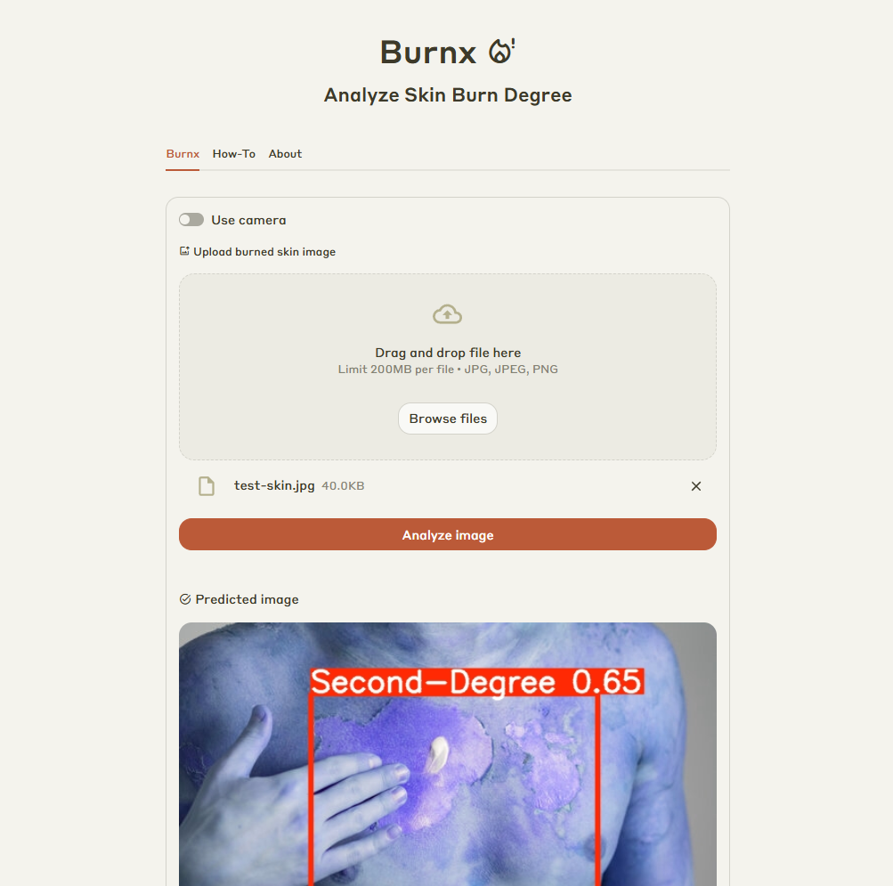

# Burnx 🔥

Burnx adalah aplikasi deteksi otomatis derajat luka bakar (tingkat 1 sampai 4) menggunakan model YOLOv11n yang dijalankan dalam format ONNX. Aplikasi ini dilengkapi dengan antarmuka berbasis Streamlit agar mudah digunakan secara langsung melalui browser.

## 🔍 Fitur

- Deteksi tingkat luka bakar dari gambar (derajat 1–4)
- Antarmuka web sederhana dengan Streamlit
- Model ringan dan cepat (YOLOv11n - ONNX)

## 🧠 Teknologi yang Digunakan

- [YOLOv11n](https://docs.ultralytics.com/models/yolo11/) (Object Detection)
- ONNX Runtime
- Streamlit (UI)

## 🚀 Coba Aplikasi

> **Note:** Karena aplikasi dihosting menggunakan Streamlit Community Cloud (free tier), aplikasi bisa dalam kondisi sleep. Jika muncul tombol “Yes, get this app back up!”, klik tombol tersebut untuk membangunkan aplikasi.

🌐 [Link Demo Aplikasi](https://burnx-detect.streamlit.app/)